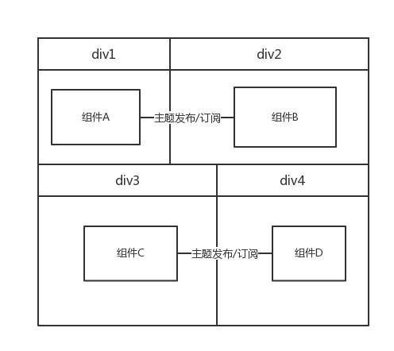

<!-- TOC -->

- [Introduction](#introduction)
    - [How to use](#how-to-use)
- [Gloabl API](#gloabl-api)
- [Intialize options](#intialize-options)
- [Components](#components)
    - [What is it](#what-is-it)
    - [How to define](#how-to-define)
        - [cmp options](#cmp-options)
    - [How to load](#how-to-load)
    - [How to communicate with other](#how-to-communicate-with-other)
        - [TopicCenter](#topiccenter)
- [Injectors](#injectors)

<!-- /TOC -->
<!-- /TOC -->

## Introduction

wc(web components)的宗旨将web前端当做组件的集合,一个页面是由一个一个的组件组成的,组件与组件之间只能通过主题的方式实现间接依赖

如下简图:


### How to use

界面引用:

```html
<script src="wc-{$注入器的名称}-{http注入器的名称}-{tpl注入器的名称}-{anim注入器的名称}-{cache注入器的名称}.js"></script>
```

注入器:

1. $ : jquery、zepto、sizzle、document.querySelectorAll自定义包装
2. http: ajax、fetch
3. tpl: nunjucks、dot、artTemplate等主流模板引擎
4. anim: 动画操作的注入器(TODO)
5. cache: 缓存操作的注入器(TODO)

## Gloabl API

1. 全局变量: `window.wc`

2. 全局接口调用列表

接口名称|作用|定义|参数说明
---------|---------|----------|----------|
conf|当前浏览器使用wc框架的初始化配置|wc.conf(options)|详见[Intialize options](#intialize-options)|
cmp|wc组件注册到框架内部的定义方法|wc.cmp(id、options、factory)|详见[cmp options](#cmp-options)|
inject|wc组件内部注入器的自定义扩展、替换 |wc.inject(name,injectVal)|
pub|
load

## Intialize options

当进行wc的初始化的时候,可以依照如下的选项进行设置：

* `$`: [`Boolean`] 是否启用dom操作功能 (Default:`true`)
* `http`: [`Boolean`] 是否启用网络请求功能 (Default:`true`)
* `tpl`: [`Boolean`] 是否启用模板引擎功能 (Default:`true`)
* `anim`: [`Boolean`] 是否启用动画功能 (Default:`true`)
* `cache`: [`Boolean`] 是否启用cache功能 (Default:`true`)
* `threshold`: [`Number`] 阈值--针对延迟加载组件特性的设置项(Default:0)(*Optional*)
* `combo`: [`Object-KV`] 启动combo特性来加快web端网络请求(*Optional*)
    + `css_root`:[`String`] 样式文件的combo地址 (*Optional*)
    + `js_root`:[`String`] 逻辑文件的combo地址(*Optional*)
* `cmps`: [`Array`] 当前页面使用的组件之间的依赖配置
    + `id`:[`String`] 组件id (**Required**)
    + `deps`:[`Object-KV`] 当前页面下该组件的主题发布订阅关系
    + `opts`:[`Object-KV`] 该组件在当前宿主环境(浏览器)中的配置(*Optional*)
    + `ctx`: [`String`] 该组件在当前宿主环境中的坐落容器(*Optional*)
    + `usage`:[`Array`] 该组件在当前宿主环境中的多个坐落容器配置
        - `ctx`: [`String`] 该组件在当前宿主环境中的坐落容器(id选择器、样式选择器、元素选择器等)
        - `opts`: [`Object-KV`] 该组件坐落在当前容器时的配置---宿主配置

```plain
Note:
    1. `cmps`配置项下的(`opts`、`ctx`)与`usage`是互斥关系
    2. `combo`配置项如果没有设置的话,最好将组件都以静态<script>的形式插入html中
    3. `usage`只有在当前组件会直接性的在当前浏览器中有多个容器出使用
```

配置案例如下:

```js
wc.conf({
    debug:true,
    combo:{
        seperator:"??",
        css_root:"//cdn/css",
        js_root:"//cdn/js"
    },
    cmps:[
        {
          id:"grid",
          deps:{
              refresh:[
                  {id:"pager",topics:"reset"},
                  {id:"sort",topics:"reset"}
              ]
          },
          ctx:"#div_0",
          opts:{
              isShowHeader:true
          }
        }
    ]
})
```

## Components

>组件

### What is it

1. 一个逻辑、样式、html布局、效果变换等都在特定边界内操作的组合

2. 具有唯一标识(组件id)

3. 具备对外选项,根据所坐落的宿主环境不同实现不同的选项配置

4. 组件具备自身构造工厂,用来实现内部特定边界内的操作

5. 组件与组件是相互隔离的,即组件是无需知道需要与哪些其他组件交互只需要知道自己会被应用在哪些场景中,从而说明组件是弱依赖的;

6. 组件与组件要形成依赖都必须通过主题中心的发布订阅操作来实现,形成弱依赖;

### How to define

通过wc.cmp(id,opts,factory)的api调用形式

#### cmp options

* `id`: [`String`] 组件的唯一标识(**Required**)
* `opts`: [`Object-KV`] 组件的对外选项定义(**Optional**)
* `factory`:[`Function`] 组件的构造工厂,所有的内部操作都在工厂里面定义和调用(**Required**)

demo

```js
 wc.cmp('test_cmp',{
     prop:1,
     prop2:2
 },function(){
     /**
     * 内部工厂定义
     */
 })
```

### How to load

```
Note: 
    1.由于wc是用在浏览器端,所有组件的加载时机与浏览器生命周期有关
    2.组件有4个状态值: 
        unfetch: 初始状态
        fetching: 正在远程下载中
        fetched: 下载完成
        loaded: 加载完成
```

组件的加载方式如下几种:

1. 直接界面引入`<script></script>`形式
2. 异步加载脚本的方式

第一种情况下的组件状态由unfetched直接变成为fetched

第二种情况又分成如下情况:

a. 批量加载:
    · combo合并请求(优化网络请求)
    · 利用浏览器的最大并发请求数
    
b. 按需加载: 利用组件的所在容器是否在文档的可视范围内进行判断是否需要加载

浏览器生命周期主要可以利用的是如下两个:

* DOMContentLoaded: 所有dom元素已经浏览器解析完毕(除了imgscript等标签的外链请求加载)
* loaded:浏览器文档内的所有资源加载完毕之后

所以一般为了性能体验,框架选择在DOM元素加载完之后执行组件的加载、装载操作;


### How to communicate with other

>组件之间所有的联系都是通过主题中心的发布订阅操作产生依赖关联的

#### TopicCenter

>主题中心,wc内所有组件的主题订阅与发布都在这里面发生

* `TopicCenter.on`: 主题的订阅
* `TopicCenter.off`: 主题的取消订阅
* `TopicCenter.emit`: 主题的发布


## Injectors
> 注入器

1.