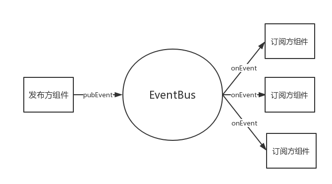

<!-- TOC -->

- [介绍](#介绍)
    - [如何使用](#如何使用)
- [初始化配置项](#初始化配置项)
- [组件](#组件)
    - [什么是组件](#什么是组件)
    - [组件的定义](#组件的定义)
        - [组件配置参数](#组件配置参数)
    - [组件的加载](#组件的加载)
    - [组件的交互](#组件的交互)
    - [组件的web化](#组件的web化)

<!-- /TOC -->

## 介绍

wc(web components)的宗旨将web前端当做组件的集合,一个页面是由一个一个的组件组成的,组件与组件之间只能通过事件的pub/on方式实现间接依赖

如下简图:


### 如何使用

界面引用:

```html
<script src="wc-dom-anim-http-tpl-cache.js"></script>
```

注入器:

1. $ : jquery、zepto、sizzle、document.querySelectorAll自定义包装
2. http: ajax、fetch
3. tpl: nunjucks、dot、artTemplate等主流模板引擎
4. anim: 动画操作的注入器(TODO)
5. cache: 缓存操作的注入器(TODO)

## 初始化配置项

当进行wc的初始化的时候,可以依照如下的选项进行设置：

* `debug`: [`Boolean`] 是否为调试模式 (Default:`false`)
* `threshold`: [`Number`] 计算是否在可视区域的阈值--针对延迟加载组件特性的设置项(Default:`0`)(*Optional*)
* `combo`: [`Object-KV`] 启动combo特性来加快web端网络请求(*Optional*)
    + `css`:[`String`] 样式文件的combo地址 (*Optional*)
    + `js`:[`String`] 逻辑文件的combo地址(*Optional*)
    + `tpl`:[`String`] 模板文件的combo地址(*Optional*)
* `root`: [`String`] 请求文件的根路径(*Optional*)

```plain
Note:
    1. `combo`配置项如果没有设置的话,最好将组件都以静态<script>的形式插入html中
    2. `debug`设置为`true`了之后,在控制台打印`wc.data`,就会将内部的数据结构都打印出来
```

配置案例如下:

```js
wc.config({
    debug:true,
    threshold:100,
    combo:{
        tpl:"/cdn/tpl??",
        css:"/cdn/css??",
        js:"/cdn/js??"
    }
})
```

## 组件

### 什么是组件

1. 一个逻辑、样式、html布局、效果变换等都在特定边界内操作的组合

2. 具有唯一标识(组件id)

3. 具备对外选项,根据所坐落的宿主环境不同实现不同的选项配置

4. 组件具备自身构造工厂,用来实现内部特定边界内的操作

5. 组件与组件是相互隔离的,即组件是无需知道需要与哪些其他组件交互只需要知道自己会被应用在哪些场景中,从而使组件是弱依赖的;

6. 组件与组件要形成依赖都必须通过事件中心的发布订阅操作来实现交互的;

### 组件的定义

通过wc.define(id,opts,factory)的api调用形式

#### 组件配置参数

* `id`: [`String`] 组件的唯一标识(**Required**)
* `opts`: [`Object-KV`] 组件的对外选项定义(**Optional**)
* `factory`:[`Function`] 组件的构造工厂,所有的内部操作都在工厂里面定义和调用(**Required**)

```js
 wc.define('test_cmp',{
     prop:1,
     prop2:2
 },function(){
     /**
     * 内部工厂定义
     */
 })
```

### 组件的加载

```plain
Note:
    1.由于wc是用在浏览器端,所有组件的加载时机与浏览器生命周期有关
    2.组件有4个状态值: 
        unfetch: 初始状态 0
        fetching: 正在远程下载中 1
        fetched: 下载完成 2
        loaded: 加载完成 3
```

组件的加载方式如下几种:

1. 直接界面引入`<script></script>`形式
2. 异步加载脚本的方式

第一种情况下的组件状态由unfetched直接变成为fetched

第二种情况又分成如下情况:

a. 批量加载:
    · combo合并请求(优化网络请求)
    · 利用浏览器的最大并发请求数
    
b. 按需加载: 利用组件的所在容器是否在文档的可视范围内进行判断是否需要加载

浏览器生命周期主要可以利用的是如下两个:

* DOMContentLoaded(ready): 所有dom元素已经浏览器解析完毕(除了imgscript等标签的外链请求加载)
* loaded:浏览器文档内的所有资源加载完毕之后

所以一般为了性能体验,框架选择在DOM元素加载完之后执行组件的加载、装载操作;

### 组件的交互

>组件之间所有的联系都是通过事件中心(EventBus)的发布订阅操作产生依赖关联的



1. 组件发布订阅关系绑定

    1) 由于组件是项目隔离的,要形成依赖需要通过事件的发布/订阅操作形成间接依赖，因此组件的交互要基于事件提前约定好发布者与订阅者的关系;

    2) 代码示例:

        ```javascript
        wc(/*组件.id*/)
            /**
                组件坐落在当前页面的哪个容器
                    ctx: 容器的类似jquery的selector字符串
                    options: 组件在此容器上的寄宿的时候的配置项
            */
            .at(/*ctx*/,/*options*/)
            /**
                组件事件的发布订阅关系设定

                当前方式表示此组件将订阅哪个发布者(publisherCMPID)的哪些名称的事件(publisherEventNames),
                并且约定一个用于接收那些EventBus转接出来的发布方事件的订阅方响应事件(subscriberResponseEventName)

            */
            .sub(/*publisherCMPID*/,/*publisherEventNames*/,/*subscriberResponseEventName*/)
        ```
2. 组件定义输出事件用来

3. 暂停/恢复模式

  * 在组件的交互过程中,会存在在订阅方有异步请求数据的过程，此时暂停和恢复模式就会起作用,但是使用这种模式的前提是:发布方需要订阅方针对发布事件的信息反馈;

  * 一般的EventBus都只是将发布方的事件运输到订阅方中,一般不负责再运输回去，所以框架内的EventBus做了调整，加入了运输订阅方反馈结果回订阅方的功能;

  * 发布方在接收到其中某订阅方的反馈信息不会立即处理,而是会等到此发布方绑定的所有订阅方的反馈结果都运输回来之后再执行处理,并且所有订阅方的反馈信息格式都必须一样

  * pause() 和 resume() 操作必须成对出现,否则堆积一多就会造成内存增长

  代码示例:

  ```javscript
  wc.define('cmp1',{},function(){
      var self = this
      self.env('ready',function(){
        self.pub('e1','test info')
      })
  })

  wc.define('cmp2',{},function(){
      var self = this
      self.out('recieve_e1',function(data){
            var scope = this

            var signal = scope.pause() //获取此次EventBus的线路追踪信号串

            self.http(url)
                .then(function(respData){
                    scope.resume(signal,respData) //恢复此信号串对应的往回运输的线路并携带反馈数据
                })
      })
  })
  ```


### 组件的web化

 因为组件是寄宿在浏览器上的,为此组件必须要适当的拥有web端的操作:

 1. $ : DOM元素的操作

 2. anim: DOM元素效果增强

 3. http: DOM元素的动态化(与服务器能够形成交互)

 4. tpl: HTML模板引擎操作

 5. cache: web端缓存操作

由于组件的宗旨是在自身的特殊边界内的操作,即组件只能操作所在容器内的所有DOM元素，故此针对`$`操作,
组件调用`$`查找元素的时候会内部强制限定在所在容器的范围内


TODO:
组件由于只能操作自身的所在容器的内的元素,故此针对浏览器宿主环境内的全局操作该如何做实现
1. url操作
2. 拖拽
3. `body`、`head`、`script`、`link`、`html`标签的操作